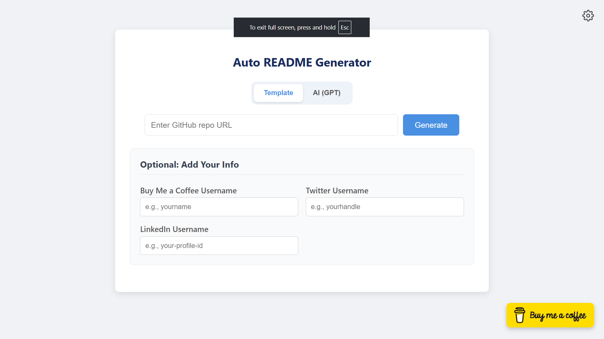

# AutoReadMe ✨

AutoReadMe is a smart web application that automatically generates well-structured README files for your GitHub repositories. You can choose between a standard template or leverage the power of AI (GPT) for a more descriptive and context-aware README.




---

## 🚀 Key Features

-   **Dual Generation Modes:**
    -   **Standard Template:** Creates a clean, structured README with predefined sections.
    -   **AI-Powered (GPT):** Analyzes your repository's structure and generates a descriptive README using the OpenAI API.
-   **Easy Setup:** Simple input for your GitHub repository URL.
-   **Personalization:**
    -   Add a "Buy Me a Coffee" button to your README.
    -   Include links to your social media profiles (Twitter, LinkedIn).
-   **Secure API Key Handling:** Your OpenAI API key is saved locally in your browser and is never sent to our server unless you use the AI feature.
-   **User-Friendly Interface:**
    -   Clean, modern, and fully mobile-responsive design.
    -   One-click "Copy to Clipboard" button for the generated README.

## 🛠️ Tech Stack

-   **Frontend:** React, JavaScript, CSS
-   **Backend:** FastAPI, Python
-   **AI Integration:** OpenAI (GPT-3.5-turbo)
-   **Repo Cloning:** GitPython

## 📂 Project Structure

Here is a brief overview of the project's structure:

```
.
├── backend/
│   ├── main.py             # FastAPI application logic
│   ├── requirements.txt      # Python dependencies
│   └── ...
└── frontend/
    ├── public/
    │   ├── index.html        # Main HTML file
    │   └── favicon.svg       # App favicon
    ├── src/
    │   ├── App.js            # Main React component
    │   ├── App.css           # Styles for the app
    │   └── index.js          # React entry point
    ├── package.json          # Node.js dependencies
    └── ...
```

## ⚙️ Setup and Installation

To run this project locally, you will need two separate terminals.

### 1. Backend Setup

```bash
# Navigate to the backend directory
cd backend

# Create and activate a virtual environment
python -m venv venv
source venv/bin/activate  # On Windows: venv\Scripts\activate

# Install dependencies
pip install -r requirements.txt

# Run the FastAPI server
uvicorn main:app --reload
```
The backend will be running at `http://localhost:8000`.

### 2. Frontend Setup

```bash
# Navigate to the frontend directory
cd frontend

# Install dependencies
npm install

# Run the React application
npm start
```
The frontend will open in your browser at `http://localhost:3000`.

## 📖 How to Use

1.  Open the application in your browser (`http://localhost:3000`).
2.  (Optional) If you want to use the AI generation, click the **settings icon** (⚙️) and enter your OpenAI API key.
3.  Choose your desired generation method: **Template** or **AI (GPT)**.
4.  Paste the URL of a public GitHub repository into the input field.
5.  (Optional) Fill in your "Buy Me a Coffee" and social media usernames.
6.  Click **Generate**.
7.  Your README will appear below. Use the **Copy** button to copy it to your clipboard.

---

*This project was built to simplify the process of creating high-quality documentation for developers.* 